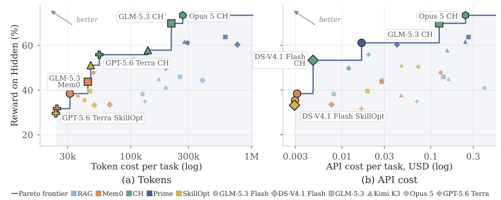
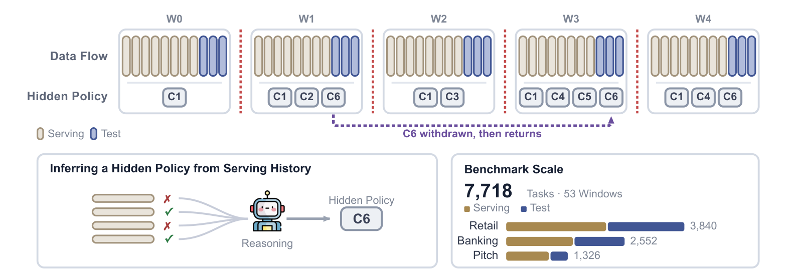

<div align="center">

<h1> ServeLearnBench</h1>

**How well can agents self-improve from serving experience?**

Haizhong Zheng<sup>1</sup>, Yizhuo Di<sup>1</sup>, Ranajoy Sadhukhan<sup>1</sup>, Shuowei Jin<sup>2</sup>, Beidi Chen<sup>1</sup>

<sup>1</sup>Carnegie Mellon University &nbsp; <sup>2</sup>Amazon

[](https://infini-ai-lab.github.io/ServeLearnBench/)
[](https://huggingface.co/datasets/haizhongzheng/ServeLearnBench)
[](./LICENSE)
[](pyproject.toml)

</div>

<p align="center"></p>

The knowledge an agent needs in deployment is often implicit, undisclosed, and subject to change. ServeLearnBench
measures whether an agent can **infer that knowledge from its own serving experience, revise it when it goes stale,
and keep behaving correctly on everything that did not change**.

Each scenario is an *evolving-environment streaming dataset* (EESD): a chronological stream of tasks split into
environment windows. A hidden policy governs each window and changes between windows. The agent never sees the
policy or any correction; after each serving task it receives only a score. Held-out test tasks at the end of every
window measure what it has learned.

<p align="center"></p>

| | Retail | Banking | Pitch |
|---|---|---|---|
| Task | multi-turn customer support over an order database | case review: card transactions, limit increases, transfers | a 40–80 word sales pitch from a product sheet |
| Hidden knowledge | categorical store rules | numeric thresholds, caps and corridors | the current customer's taste |
| Grading | final database state or the right refusal code | the decision and its reason code | LLM-judged rubric (coverage, penalties for disliked, false or invented claims) |
| Tiers | L1 acquisition · L2 revision and composition · L3 non-monotonic change | same | same |

Nine scenarios, **53 windows, 4,508 serving tasks and 3,210 held-out test tasks**.

## Installation

```bash
git clone https://github.com/Infini-AI-Lab/ServeLearnBench.git
cd ServeLearnBench
pip install -e .            # Python 3.12+
slb verify                  # regenerates all nine scenarios and checks them against the paper's
```

## Quick start

Any OpenAI-compatible endpoint with native tool calling works. The key is read from `SLB_API_KEY`.
Use the command line for a quick baseline run, or the Python API to configure a run in code. Both use the same
task streams, learning schedule, and evaluator.

### Command line

```bash
export SLB_API_KEY=...

# Blind and Oracle references on one scenario (test tasks only)
slb run --scenario banking_l1 --method blind  --model accounts/fireworks/models/glm-5p3-flash
slb run --scenario banking_l1 --method oracle --model accounts/fireworks/models/glm-5p3-flash

# a learning method: the full serving stream, then the test sets of every window
slb run --scenario banking_l1 --method rag --model accounts/fireworks/models/glm-5p3-flash

# setting scores and averages, as reported in the paper
slb score results/*/*.jsonl
```

### Python API

With `SLB_API_KEY` set, run the same RAG evaluation and inspect its scores directly:

```python
from servelearnbench.llm import ModelConfig
from servelearnbench.methods import RAG
from servelearnbench.runner import run
from servelearnbench.scoring import read_rows, setting_scores

model = ModelConfig(
    model="accounts/fireworks/models/glm-5p3-flash",
    base_url="https://api.fireworks.ai/inference/v1",
)
output = run(
    scenario="banking_l1",
    method=RAG(),
    model_cfg=model,
    out="results/banking_l1_rag.jsonl",
)
_, tasks = read_rows(output)
print(setting_scores(tasks))
```

Replace `RAG()` with `Blind()` or `Oracle()` (imported from the same methods module) to run a reference baseline.
To implement your own learning method, see [examples/custom_method.py](examples/custom_method.py) and
[the method interface](docs/methods.md).

The CLI writes results to `results/<model>/<scenario>_<method>.jsonl`; the Python API uses the path supplied as
`out`. Each file records task rewards and full trajectories.
Pitch is scored by an LLM judge (`--judge-model`, default `glm-5p3-flash` at high reasoning effort, as in the paper).
See [docs/getting-started.md](docs/getting-started.md) for all options and local servers.

## Methods

| Method | Learns | Description |
|---|:---:|---|
| `blind` | – | the domain prompt and the task only; no serving experience |
| `oracle` | – | additionally told the hidden policy of the current window |
| `rag` | ✓ | BM25 retrieval of the agent's own past episodes (with their scores) into the prompt |

A new method implements two hooks, `context()` and `update()`; see [docs/methods.md](docs/methods.md).
The paper also evaluates Mem0, SkillOpt, Continual Harness and Prime; their results are listed with the others under [Results](#results).

## Results

Scores of every model and method evaluated in the paper are on the [project website](https://infini-ai-lab.github.io/ServeLearnBench/)
and in [docs/leaderboard.csv](docs/leaderboard.csv).

## Documentation

- [Getting started](docs/getting-started.md): installation, endpoints, running and scoring
- [Benchmark](docs/benchmark.md): the EESD formulation, domains, tiers and scenarios
- [Protocol](docs/protocol.md): what the agent and a learning method may see, budgets, scoring
- [Methods](docs/methods.md): the three included methods and how to add your own
- [Data](docs/data.md): the dataset files in `dataset/` and their fields

## Repository layout

```
servelearnbench/
  agent.py        the tool-calling agent loop
  llm.py          OpenAI-compatible client (streaming, retries, token accounting)
  runner.py       serving stream and window test sets for one method on one scenario
  methods/        Blind, Oracle, RAG, and the Method interface
  scenarios.py    the nine scenarios
  scoring.py      setting scores and averages
  protocol.py     budgets, the score line, the episode record, stream timestamps
  engine/         environment, tools, and the rule-based verifier
  domains/        retail/, banking/, pitch/ with tiers l1, l2, l3
tests/            offline tests (no API calls)
docs/             documentation and the leaderboard CSV
website/          the project page (GitHub Pages), built by website/build.py
dataset/          the exported task streams and environments of all nine scenarios
examples/
```

## Citation

If you find ServeLearnBench useful, please cite:

```bibtex
@misc{zheng2026servelearnbench,
  title  = {ServeLearnBench: How Well Can Agents Self-Improve from Serving Experience?},
  author = {Zheng, Haizhong and Di, Yizhuo and Sadhukhan, Ranajoy and Jin, Shuowei and Chen, Beidi},
  year   = {2026}
}
```

## License

Apache 2.0.
